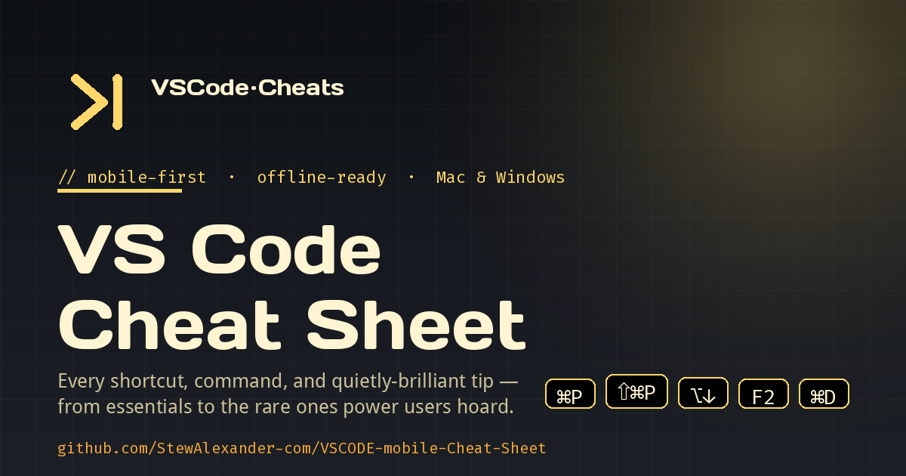

# VS Code Mobile Cheat Sheet

A mobile-first, offline-ready Visual Studio Code cheat sheet — every shortcut, command, and quietly-brilliant tip for **macOS** and **Windows**, from the moves you use every day to the rare ones power users hoard.

## 🔗 Live cheat sheet

**[Open the cheat sheet →](https://stewalexander-com.github.io/VSCODE-mobile-Cheat-Sheet/)**

Served from GitHub Pages. Once loaded, the page works offline (service worker caches the app shell + Google Fonts). On Chrome / Edge / Safari you can also "Add to Home Screen" or install it as a PWA.



## What's inside

16 sections, ~165 entries verified against the official [macOS](https://code.visualstudio.com/shortcuts/keyboard-shortcuts-macos.pdf) and [Windows](https://code.visualstudio.com/shortcuts/keyboard-shortcuts-windows.pdf) keyboard shortcut PDFs:

1. Essentials
2. Editing Basics
3. Multi-Cursor & Selection
4. Navigation
5. Search & Replace
6. Code Folding & Display
7. IntelliSense & Refactoring
8. Integrated Terminal
9. Git & Source Control
10. Debugging
11. Window & Layout
12. Extensions Worth Knowing
13. `settings.json` Power Tips
14. Hidden Gems & Rare Tips
15. Mac-Only Quirks
16. Windows-Only Quirks

Every section ends with a one- or two-sentence **Takeaway / gotcha** — the kind of thing you'd want a senior engineer to whisper in your ear.

## Design

- Dark charcoal gradient background, cream-yellow text — clean, high-contrast, easy on the eyes (yes, even with reading glasses).
- **Days One** for subtitles, **Droid Sans** for body, **Fira Code** for keys and code blocks.
- Two-column tables on desktop; on mobile portrait the rows transform into clean labelled cards.
- Hamburger menu (top-right) opens a clickable table of contents that jumps to any section.
- Landscape mobile reflows gracefully — the cheat sheet works in any orientation.

## Offline support

Open the site once with a connection, then it works without one. The service worker uses cache-first for the app shell and stale-while-revalidate for Google Fonts.

## Project structure

```
.
├── index.html              # SEO + OG + Twitter meta, structured data, hero, drawer
├── styles.css              # Charcoal gradient, two-column tables, mobile cards
├── app.js                  # Renderer + drawer behavior + SW registration
├── data.js                 # All 16 sections of cheat sheet content
├── sw.js                   # Service worker (offline cache)
├── manifest.webmanifest    # PWA manifest
└── icons/
    ├── icon-192.png
    ├── icon-512.png
    ├── icon-maskable-512.png
    ├── apple-touch-icon.png
    └── og-image.png        # 1200×630 social share card
```

## Run locally

It's static HTML — open `index.html` directly, or:

```bash
python3 -m http.server 8000
# then visit http://localhost:8000
```

## Sources

- [VS Code keyboard shortcuts (macOS)](https://code.visualstudio.com/shortcuts/keyboard-shortcuts-macos.pdf)
- [VS Code keyboard shortcuts (Windows)](https://code.visualstudio.com/shortcuts/keyboard-shortcuts-windows.pdf)
- [VS Code documentation](https://code.visualstudio.com/docs)
- [Tips and Tricks](https://code.visualstudio.com/docs/getstarted/tips-and-tricks)
- [microsoft/vscode on GitHub](https://github.com/microsoft/vscode)

## License

MIT — see [`LICENSE`](LICENSE).
